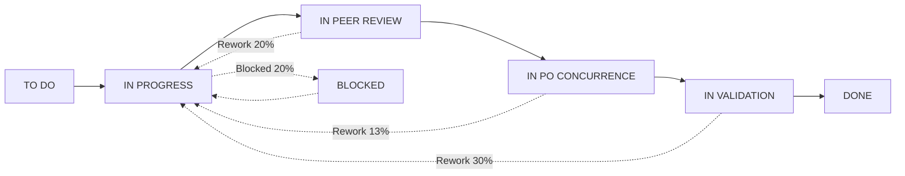
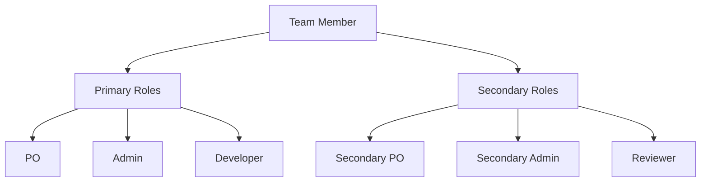
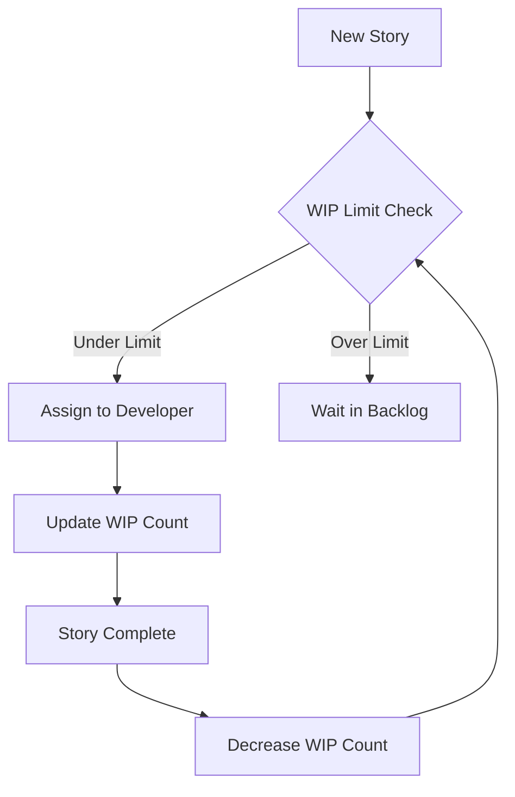

# Scrum Team Modeling and Simulation

## Overview
This project implements a discrete event simulation of a Scrum team's development process using SimPy. The simulation models team member interactions, resource constraints, and workflow patterns to analyze team performance and identify bottlenecks.

## Implementation Details
Project Structure:
```plaintext
ScrumTeamModeling/
│
├── README.md           # Project documentation
├── Premise.md         # Project requirements and goals
├── main.py            # Application entry point
├── requirements.txt   # Project dependencies
│
├── images/            # Generated visualization plots
│   ├── cycle_time_dist.png
│   ├── resource_util.png
│   ├── sprint_velocity.png
│   ├── story_flow.png
│   └── team_utilization.png
│
└── src/               # Source code
    ├── enums.py       # Role, Phase, and Meeting enums
    ├── models.py      # Story and TeamMember domain models
    ├── simulation.py  # Core simulation logic
    └── visualization.py # Analysis and visualization
```

### Core Components

#### 1. Domain Models (`src/models.py`)
- **TeamMember**: Represents individual team members with:
  - Multiple role capabilities (primary and secondary roles)
  - Work hour tracking (daily/weekly)
  - Context switching metrics
  - Maximum work constraints:
    - Daily hours: 8.0
    - Weekly hours: 40.0
    - 20% buffer for context switching

- **Story**: Represents work items with:
  - Story points (1, 2, 3, 5, 8)
  - Phase tracking
  - Time metrics
  - Review iteration limits:
    - Peer review: 3 attempts
    - PO review: 2 attempts
    - Validation: 2 attempts

#### 2. Role Hierarchy (`src/enums.py`)
- **Product Owner (PO) Roles**:
  - Primary PO (highest authority)
  - Secondary PO
  - Tertiary PO
  - Hierarchical constraints prevent multiple PO roles on same story

- **Admin Roles**:
  - Primary Admin
  - Secondary Admin
  - Tertiary Admin
  - Similar hierarchical constraints as PO roles

- **Other Roles**:
  - Developer
  - Reviewer

#### 3. Work Phases (`src/enums.py`)
1. TO DO
2. IN PROGRESS
3. BLOCKED
4. IN PEER REVIEW
5. IN PO CONCURRENCE
6. IN VALIDATION
7. DONE

#### 4. Work in Progress (WIP) Management
- Dynamic WIP limits based on team size:
  - Default: 2 * number of developers
  - Prevents overloading team capacity
  - Reduces context switching overhead
  - Improves flow efficiency

#### 5. Resource Management
- Daily work hour tracking per team member
- Role-based resource pools
- Context switching metrics
- Workload balancing across team members
- Reviewer role assignment for all developers

### Simulation Parameters (`src/simulation.py`)

#### Time Allocation (Story Points to Hours)
```python
base_hours = {
    1: {'dev': 4, 'review': 1, 'po': 0.5, 'validation': 1, 'documentation': 0.5},
    2: {'dev': 8, 'review': 2, 'po': 1, 'validation': 2, 'documentation': 1},
    3: {'dev': 16, 'review': 3, 'po': 1.5, 'validation': 3, 'documentation': 1.5},
    5: {'dev': 24, 'review': 5, 'po': 2, 'validation': 5, 'documentation': 2},
    8: {'dev': 40, 'review': 8, 'po': 3, 'validation': 8, 'documentation': 3}
}
```
- Includes ±20% random variation to model task uncertainty

#### Team Composition
- Default team size: 10 members
  - 1 Primary PO
  - 2 Secondary/Tertiary POs (also Developers)
  - 1 Primary Admin
  - 2 Secondary/Tertiary Admins (also Developers)
  - 4 Pure Developers

#### Sprint Parameters
- Sprint duration: 10 days
- Working hours: 8 per day
- Ceremonies:
  - Sprint Planning: 2 hours
  - Daily Standup: 0.5 hours
  - Sprint Review: 1 hour
  - Sprint Retrospective: 1 hour

### Process Modeling

#### Development Flow
1. Story assignment based on availability and role capabilities
2. 20% chance of blocking during development
3. Review processes with iteration limits
4. Rework calculations:
   - Peer review: 20% of original dev time
   - PO review: 10% of original dev time
   - Validation: 15% of original dev time

#### Resource Management
- Role-based resource pools with capacity limits
- Hierarchical role constraints
- Work hour tracking and limits
- Context switch tracking

### Analysis Metrics (`src/visualization.py`)

#### Team Performance
- Sprint velocity
- Story completion rates
- Cycle time analysis
- Story point distribution

#### Resource Utilization
- Team member utilization rates
- Context switching frequency
- Role-based workload distribution
- Resource contention patterns

#### Process Efficiency
- Phase duration analysis
- Bottleneck identification
- Rework rates
- Wait time analysis

### Performance Metrics

#### 1. Cycle Time Analysis
- Overall metrics:
  - Mean: ~44 hours
  - Median: ~27 hours
  - Standard deviation: ~37 hours
- Story size correlation with cycle time
- Bottleneck identification in workflow

#### 2. Sprint Metrics
- Average velocity: 20 points/sprint
- Completion rate tracking
- Sprint-over-sprint performance analysis

#### 3. Quality Metrics
Rework rates by phase:
- Peer Review: 20%
- PO Review: 13%
- Validation: 30%

#### 4. Resource Utilization
- Daily hours worked tracking
- Meeting impact on productivity
- Context switching frequency
- Role-based utilization rates

### Key Findings

1. **Work Distribution**
   - Larger stories (8 points) show higher variability in completion time
   - Small stories (1-2 points) have more predictable cycle times
   - WIP limits help maintain steady flow

2. **Resource Constraints**
   - Meeting overhead impacts daily productivity
   - Review capacity can become a bottleneck
   - Context switching affects team efficiency

3. **Process Efficiency**
   - Validation phase shows highest rework rate (30%)
   - Peer review process is effective at catching issues early
   - PO review process shows good efficiency

## Running the Simulation

### Prerequisites
```bash
pip install -r requirements.txt
```

### Execution
```bash
python main.py
```

### Output
1. Velocity trend visualization
2. Bottleneck analysis plots
3. Team utilization graphs
4. Cycle time analysis
5. Detailed metrics summary

## Research Assumptions

1. **Work Patterns**
   - Team members maintain consistent availability
   - Work is distributed based on role capabilities
   - Context switching has a 20% productivity impact

2. **Process Flow**
   - Stories follow a linear progression through phases
   - Reviews may require multiple iterations
   - Blocking occurs randomly with 20% probability

3. **Resource Constraints**
   - Team members can perform multiple roles
   - Primary roles take precedence over secondary roles
   - Work hours are strictly enforced

4. **Time Management**
   - Fixed sprint duration
   - Standard ceremonies
   - Regular working hours

## Limitations

1. Does not model:
   - Skill level variations
   - Learning curves
   - Team dynamics
   - External dependencies
   - Vacation/leave patterns

2. Assumes:
   - Perfect communication
   - No technical debt impact
   - Consistent story complexity within point values

## Future Research Directions

1. **Dynamic Team Modeling**
   - Skill development over time
   - Team learning patterns
   - Dynamic role assignment

2. **Advanced Process Analysis**
   - Dependencies between stories
   - Technical debt impact
   - Quality metrics

3. **Resource Optimization**
   - Optimal team composition
   - Role allocation strategies
   - Work distribution patterns

## Process Flow Diagrams

#### 1. Story Lifecycle


#### 2. Team Role Hierarchy


#### 3. WIP Flow Control



## References

1. SimPy Documentation: https://simpy.readthedocs.io/
2. Scrum Guide: https://scrumguides.org/
3. Agile Estimation Techniques: Various sources
